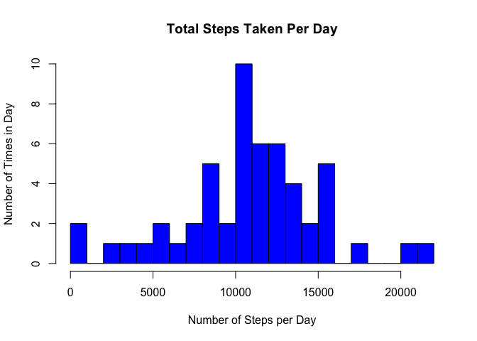
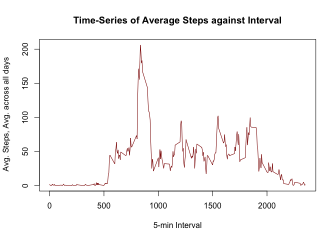
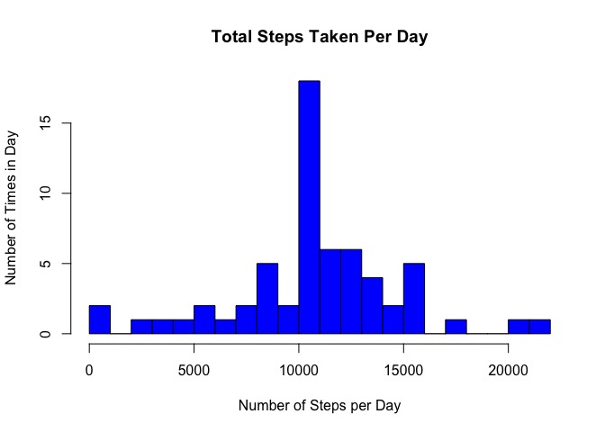
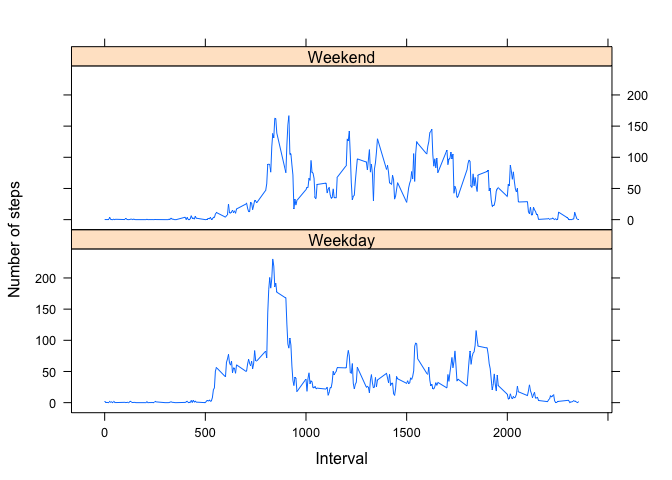

# Reproducible Research: Peer Assessment 1
## Introduction
This assignment is part of  Course [Reproducible Research](https://class.coursera.org/repdata-013) from  [Coursera](https://www.coursera.org). The assignment is a **single R markdown document**  that transforms to HTLML output using **knitr**.

The assignment makes use of data from a personal activity monitoring device. This device collects data at 5 minute intervals through out the day. The data consists of two months of data from an anonymous individual collected during the months of October and November, 2012 and include the number of steps taken in 5 minute intervals each day.

## Assignment

#### Set global environment
Set **echo = TRUE** for easier code analysis by peer reviewers. 


```r
library(knitr)
opts_chunk$set(echo = TRUE, results = 'hold')
```

#### Load required libraries

```r
library(lubridate, quietly = TRUE) #To use "ymd()" function 
library(chron, quietly = TRUE)  #To use "is.weekday()" function
```

```
## 
## Attaching package: 'chron'
## 
## The following objects are masked from 'package:lubridate':
## 
##     days, hours, minutes, seconds, years
```

```r
library(lattice, quietly = TRUE) 
```

```
## Warning: package 'lattice' was built under R version 3.1.3
```

### Loading and preprocessing the data
**Prerequisite:** Download the data ***activity.zip*** from [link](https://d396qusza40orc.cloudfront.net/repdata%2Fdata%2Factivity.zip). Unzip the ***activity.zip*** and set working directory to this location.

#### 1. Read data from activity.csv

```r
activity <- read.csv("activity.csv", header = TRUE, sep = ",")
str(activity)
```

```
## 'data.frame':	17568 obs. of  3 variables:
##  $ steps   : int  NA NA NA NA NA NA NA NA NA NA ...
##  $ date    : Factor w/ 61 levels "2012-10-01","2012-10-02",..: 1 1 1 1 1 1 1 1 1 1 ...
##  $ interval: int  0 5 10 15 20 25 30 35 40 45 ...
```

#### 2. Transform data for analysis

```r
activity$date <- ymd(activity$date) ## convert to date class
str(activity)
```

```
## 'data.frame':	17568 obs. of  3 variables:
##  $ steps   : int  NA NA NA NA NA NA NA NA NA NA ...
##  $ date    : POSIXct, format: "2012-10-01" "2012-10-01" ...
##  $ interval: int  0 5 10 15 20 25 30 35 40 45 ...
```

### What is mean total number of steps taken per day?
#### 1. Calculate the total number of steps taken per day

```r
StepsPerDay <- aggregate(steps ~ date, activity, sum, na.rm = TRUE)
head(StepsPerDay)
```

```
##         date steps
## 1 2012-10-02   126
## 2 2012-10-03 11352
## 3 2012-10-04 12116
## 4 2012-10-05 13294
## 5 2012-10-06 15420
## 6 2012-10-07 11015
```

#### 2. Make a histogram of the total number of steps taken each day

```r
hist(StepsPerDay$steps, breaks=20, main = "Total Steps Taken Per Day", xlab="Number of Steps per Day", ylab="Number of Times in Day", col = "blue")
```

 

#### 3. Calculate and report the mean and median of the total number of steps taken per day

```r
StepsMean   <- mean(StepsPerDay$steps, na.rm = TRUE); StepsMean
StepsMedian <- median(StepsPerDay$steps, na.rm = TRUE); StepsMedian
```

```
## [1] 10766.19
## [1] 10765
```

The mean is **10766.19** and the median is **10765** of the total number of steps take per day.

### What is the average daily activity pattern?
Find the average number of steps taken for each 5-minute interval averaged across all days.

```r
StepsPerInterval <- aggregate(steps ~ interval, activity, mean, na.rm=TRUE)
head(StepsPerInterval)
```

```
##   interval     steps
## 1        0 1.7169811
## 2        5 0.3396226
## 3       10 0.1320755
## 4       15 0.1509434
## 5       20 0.0754717
## 6       25 2.0943396
```

#### 1. Make a time series plot (i.e. type = "l") of the 5-minute interval (x-axis) and the average number of steps taken, averaged across all days (y-axis)

```r
with(StepsPerInterval, plot(interval, steps, type = "l", xlab = "5-min Interval", ylab = " Avg. Steps, Avg. across all days", main = "Time-Series of Average Steps against Interval", col = "dark red"))
```

 

#### 2. Which 5-minute interval, on average across all the days in the dataset, contains the maximum number of steps?

```r
MaxInterval <- StepsPerInterval[which.max(StepsPerInterval$steps),]
MaxInterval
```

```
##     interval    steps
## 104      835 206.1698
```
The **835<sup>th<sup>** interval has the maximum number of steps, which is **206.16981**.

### Imputing missing values
#### 1. Calculate and report the total number of missing values in the dataset

```r
countNA <- sum(is.na(activity$steps)) 
countNA
```

```
## [1] 2304
```
Total number of **missing values** are **2304**.

#### 2. Fill in all the missing values in the dataset. 
For filling in the missing values the approach here is to use the average 5-minute interval values from original dataset.


```r
StepsData <- data.frame(activity$steps)
StepsData[is.na(StepsData),] <- ceiling(tapply(activity$steps,activity$interval,mean,na.rm=TRUE))
```

#### 3. Create a new dataset that is equal to the original dataset but with the missing data filled in.

```r
activityNew <- cbind(StepsData, activity[,2:3])

str(activity)
str(activityNew) ## check number of obs. in dataset is same as original 

sum(is.na(activity$steps))
sum(is.na(activityNew$activity.steps)) ## check there are no missing values
```

```
## 'data.frame':	17568 obs. of  3 variables:
##  $ steps   : int  NA NA NA NA NA NA NA NA NA NA ...
##  $ date    : POSIXct, format: "2012-10-01" "2012-10-01" ...
##  $ interval: int  0 5 10 15 20 25 30 35 40 45 ...
## 'data.frame':	17568 obs. of  3 variables:
##  $ activity.steps: num  2 1 1 1 1 3 1 1 0 2 ...
##  $ date          : POSIXct, format: "2012-10-01" "2012-10-01" ...
##  $ interval      : int  0 5 10 15 20 25 30 35 40 45 ...
## [1] 2304
## [1] 0
```

#### 4. Make a histogram of the total number of steps taken each day.

```r
TotalStepsPerDay <- aggregate(activity.steps ~ date, activityNew, sum)
with(TotalStepsPerDay, hist(activity.steps, breaks=20, main = "Total Steps Taken Per Day", xlab="Number of Steps per Day", ylab="Number of Times in Day", col = "blue"))
```

 

#### Calculate and report the mean and median total number of steps taken per day.

```r
TotalStepsMean <- mean(TotalStepsPerDay$activity.steps, na.rm = TRUE)
TotalStepsMean
TotalStepsMedian <- median(TotalStepsPerDay$activity.steps, na.rm = TRUE)
TotalStepsMedian
```

```
## [1] 10784.92
## [1] 10909
```

The mean is **10784.918** and median is **10909**.

#### Do these values differ from the estimates from the first part of the assignment?
Adding missing values to the original data has increased the mean and median.

1. Before filling in missing values:
        - Mean: **10766.189**
        - Median: **10765**

2. After filling in missing values:
        - Mean: **10784.918**
        - Median: **10909**

#### What is the impact of imputing missing data on the estimates of the total daily number of steps?
Imputing the missing values has slighty increased the mean and median peaks. However this increase in peak does not negatively impact the t-distribution.

### Are there differences in activity patterns between weekdays and weekends?
We will be using filled-in missing values dataset to find the difference. 

#### 1. Create a new factor variable in the dataset with two levels – “weekday” and “weekend” indicating whether a given date is a weekday or weekend day.

```r
TypeOfDay <- data.frame(sapply(activityNew$date,function(day) {
        ifelse(is.weekend(day),"Weekend", "Weekday")
}))
activityNew_with_TypeOfDay <- cbind(activityNew, TypeOfDay)
colnames(activityNew_with_TypeOfDay) <- c("Steps", "Date", "Interval", "TypeOfDay")
str(activityNew_with_TypeOfDay)
head(activityNew_with_TypeOfDay)
```

```
## 'data.frame':	17568 obs. of  4 variables:
##  $ Steps    : num  2 1 1 1 1 3 1 1 0 2 ...
##  $ Date     : POSIXct, format: "2012-10-01" "2012-10-01" ...
##  $ Interval : int  0 5 10 15 20 25 30 35 40 45 ...
##  $ TypeOfDay: Factor w/ 2 levels "Weekday","Weekend": 1 1 1 1 1 1 1 1 1 1 ...
##   Steps       Date Interval TypeOfDay
## 1     2 2012-10-01        0   Weekday
## 2     1 2012-10-01        5   Weekday
## 3     1 2012-10-01       10   Weekday
## 4     1 2012-10-01       15   Weekday
## 5     1 2012-10-01       20   Weekday
## 6     3 2012-10-01       25   Weekday
```

#### 2. Make a panel plot containing a time series plot (i.e. type = "l") of the 5-minute interval (x-axis) and the average number of steps taken, averaged across all weekday days or weekend days (y-axis).

Find average number of steps taken for each 5-minute interval, averaged across all weekday days or weekend days.

```r
TypeOfDayIntervalSteps <- aggregate(Steps ~ Interval + TypeOfDay, activityNew_with_TypeOfDay, mean)
head(TypeOfDayIntervalSteps)
```

```
##   Interval TypeOfDay     Steps
## 1        0   Weekday 2.2888889
## 2        5   Weekday 0.5333333
## 3       10   Weekday 0.2888889
## 4       15   Weekday 0.3111111
## 5       20   Weekday 0.2222222
## 6       25   Weekday 1.7111111
```

#### Make a panel plot containing a time series plot (i.e. type = "l") 

```r
with(TypeOfDayIntervalSteps, xyplot(Steps ~ Interval | TypeOfDay, TypeOfDayIntervalSteps,type = "l", xlab="Interval", ylab="Number of steps", layout=c(1,2)))
```

 

The above graph shows that activity on the weekday has the greatest peak and the weekends activities has more peaks than weekday. This could be due to additional time available on the weekends.
